# OAuth2 & OIDC flow

To view this diagram, please install the PlantUML Visualizer browser extension:

- [Chrome](https://chrome.google.com/webstore/detail/plantuml-visualizer/ffaloebcmkogfdkemcekamlmfkkmgkcf?hl=en)
- [Firefox](https://addons.mozilla.org/fr/firefox/addon/plantuml-visualizer/)

```plantuml
@startuml
skinparam ParticipantPadding 20
skinparam BoxPadding 10
' skinparam maxMessageSize 60

box Client
participant "Front-end" as fe1
participant "Back-end" as be1
end box

box AuthorizationServer
participant "Front-end" as fe2
participant "Back-end" as be2
database "Database" as db2
end box

Note over fe1,be1: App starts\n<b>Silent login</b>
fe1 -> be1: <b>GET</b> /user
be1 --> fe1: <b>401</b> Unauthorized
fe1 -> be1: <b>POST</b> /refresh

alt No refresh token
be1 -> be1: No refresh token
be1 --> fe1: <b>401</b> Unauthorized

else Has refresh token
group Retrieve local access token
be1 -> be1: Verify JWT
be1 -> be1: Decode user ID\nfrom JWT
be1 -> be1: Find access\ntoken
end
be1 -> be2: <b>POST</b> /api/oauth2/introspect?token="..."\n<b>headers:</b> { client-id, client-secret }

group Check access token
be2 <-> db2: Check client ID & secret
Note over db2 #aafac8: Table: clients
be2 <-> db2: Check access token exists\nand matches client ID
Note over db2 #aafac8: Table: access-tokens
be2 -> be2: Check client still has\naccess to user
be2 <-> db2: Check user still exists
Note over db2 #aafac8: Table: users
be2 -> be2: Check access token\nlast used
end

be2 <-> db2: Update access token last used
Note over db2 #aafac8: Table: access-tokens

be2 --> be1: <b>200</b>\n{ active: true }
be1 --> fe1: <b>200</b>\nJWT

fe1 -> be1: <b>GET</b> /user
ref over be1: Retrieve local access token
be1 -> be2: <b>GET</b> /api/oidc/userinfo?token="..."\n<b>headers:</b> { client_id, client_secret }\n

ref over be2, db2: Check access token

be2 <-> db2: Update access token last used
Note over db2 #aafac8: Table: access-tokens
be2 -> be2: Generate id_token from scope

be2 --> be1: <b>200</b> OK\n{ id_token } (see content below)
be1 --> fe1: <b>200</b> OK
end

...

Note over fe1: User navigates\nto protected route

alt Not logged in (Client side)

fe1 -> fe1: Redirects to /login
Note over fe1: Login page contains\na button to login\nwith Xenia.\nUser clicks.

fe1 -> be1: POST /code-challenge
be1 -> be1: Generate\ncode_verifier &\ncode_challenge
be1 --> fe1: <b>200</b> OK\n{ code_challenge }

fe1 -> fe2: Redirect to /oauth2/login
Note over fe1, fe2: <b>Params:</b> response_type="code", scope="email openid profile",\nclient_id="...", redirect_uri="...", code_challenge="...",\ncode_challenge_method="S256"
fe2 -> be2: <b>GET</b> /user
be2 --> fe2: <b>401</b> Unauthorized
fe2 -> be2: <b>POST</b> /refresh

alt Logged in (Client side)
be2 --> fe2: <b>200</b>\nJWT
fe2 -> be2: <b>GET</b> /user
else not logged in
be2 --> fe2: <b>400</b>: Unauthorized
Note over fe2: User submits login\nform
fe2 -> be2: <b>POST</b> /api/auth/login\n<b>body:</b> { email, password }
be2 <-> db2: Check user\n{ email, password }
end
be2 --> fe2: <b>200</b> OK
fe2 -> be2: <b>POST</b> /api/oauth2/authorize\n<b>body:</b> { client_id,\nscope="email openid profile",\nresponseType="code", codeChallenge,\ncodeChallengeMethod="S256" }
be2 <-> db2: Find client
Note over db2 #aafac8: Table: clients
be2 -> be2: Check client access rights
be2 <-> db2: Create authorization code
Note over db2 #aafac8: Table: authorization-codes
Note over be2, db2: Auth code are short lived (under a minute)\n& and revoked after first try
Note over be2, db2: <b>Row contains</b>: ID, Client ID, User ID,\nScope, Expiration, Code challenge,\nCode challenge method
be2 --> fe2: <b>200</b> OK\n { authorizationCode }
fe2 -> fe1: Redirect to <i>redirect_uri?code="..."&code_challenge="..."</i>

fe1 -> be1: <b>POST</b> /oauth2/token?\nauthorizationCode="..."&\ncodeChallenge="..."
be1 -> be1: Find matching\ncode_verifier
be1 -> be2: <b>POST</b> /api/oauth2/token\n<b>headers:</b> { client_id, client_secret }\n<b>body:</b> { grant_type="authorization_code", code_verifier, code }
be2 <-> db2: Check client ID & secret
Note over db2 #aafac8: Table: clients
be2 <-> db2: Find authorization code by ID\n& client ID, then delete it
Note over db2 #aafac8: Table: authorization-codes
be2 -> be2: Check client access rights
be2 -> be2: Check expiration
be2 -> be2: Hash code_verifier using\ncode_challenge_method\n& compare to\ncode_challenge
be2 <-> db2: Create access token
Note over db2 #aafac8: Table: access-tokens
Note over be2, db2: <b>Row contains</b>: _id, userId, clientId, token, lastUsed
be1 <-- be2: <b>200</b> OK\n{ token_type: "Bearer", access_token,\nscope: "email openid profile", id_token }
Note over be1, be2: <b>access_token</b> is an ID\n<b>id_token</b> is a JWT. Payload contains following claims: sub (i.e. id), given_name, family_name \n<b><u>Access tokens have no expiration since they are issued to confidential clients only</u></b>
be1 -> be1: Extract user ID\nfrom id_token
be1 -> be1: Save access_token
be1 --> fe1: <b>200</b> OK\nJWT + refresh_token
Note over fe1, be1: JWT and refresh token contain user ID

end

...

Note over fe1: User interacts
fe1 -> be1: <b>GET</b> /some-protected-ws
ref over be1: Retrieve local access token
be1 -> be2: <b>POST</b> /api/oidc/userinfo?token="..."\n<b>headers: </b>{ client_id, client_secret }
ref over be2, db2: Check access token
be2 <-> db2: Update access token last used
Note over db2 #aafac8: Table: access-tokens
be2 -> be2: Generate id_token from scope
be2 --> be1: <b>200</b> OK\n{ id_token }
be1 -> be1: Some work
be1 --> fe1: <b>200</b> OK\n{ ... }
@enduml
```

